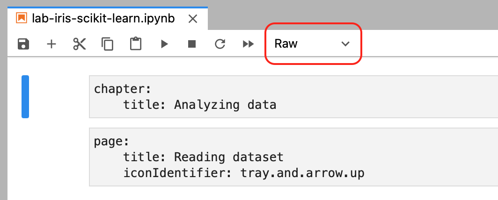
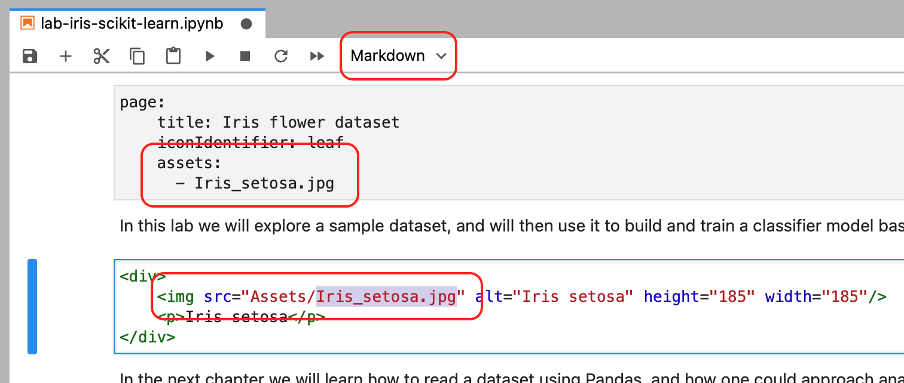
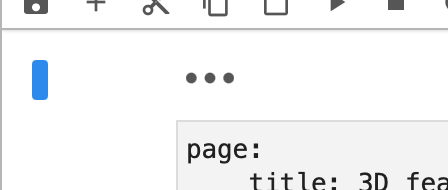
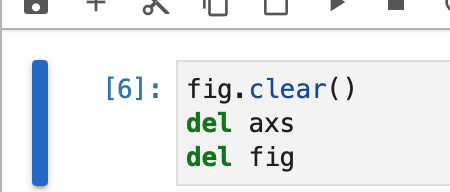

# Preparing a Lab

Preparing a lab is fairly easy: you simply put your tutorial together as a single Jupyter notebook while following a couple of formatting conventions, and place image assets and data into predefined locations. Key things to keep in mind:

## Environment
The app comes with a specific Python environment, and labs should be prepared using the same versions of interpreter and packages. The [environment.yml](environment.yml) file in conda format is in this repo. You can use any additional pure Python packages, which are not in the .yml file — as long as they don't have native extensions (.c files compiled into libraries). Put all additional packages into the _Packages_ folder, and assume they will be available for import anywhere in the notebook. Mind that although `pip` is in the environment file, it will not be available in the app.

> Although you can't use some "big name" packages like TensorFlow or PyTorch (at least for now), current environment already has plenty of packages to work with: SciPy, Scikit-learn, Pandas, LXML, Matplotlib, NumPy, Pillow and others.

## Manifests
This is a fancy word for text cells with a simple YAML configuration, which will indicate where each chapter and page begins in your notebook. Put manifest for every chapter and page in a separate "Raw" cell: 

<p align="center">
  
</p>

> Mind that `iconIdentifier` here is the name of a [SF Symbols](https://developer.apple.com/sf-symbols/) glyph (you can check out some of them here: https://github.com/cyanzhong/sf-symbols-online) — it is optional, and if you don't provide one, a generic icon will be used. 

Manifest cells mark the beginning of a new chapter or page, and there are no "closing" markings; chapters and pages are assumed to go on until the next one begins. Additionally, the first cell of the notebook should have a lab manifest, specifying lab title, brief description and author name (see lab example).

## Folder structure
As mentioned earlier, additional Python packages go to the _Packages_ directory. All data should be in _Data_ folder, and all images from Markdown cells should be in _Assets_ folder. Each page referencing images in Markdown cells should specify them in the manifest:

<p align="center">
  
</p>

## Content guidelines
A few things that will make a lab look and feel its best in the app:
* A lab would usually have narrative structure of a step-by-step tutorial, separated into chapters and pages with continuity in mind.
* Prefer smaller pages and consider breaking down long ones. Keep in mind that _Run Code_ button will execute all code cells on a page at once, so this would work best with pages that fit on a single screen without too much scrolling.
* Use more text and images! Everything that Jupyter supports will be rendered correctly, including HTML, LaTeX formulas, etc. If you have multiple headings on the page, keep in mind that page title will appear as a level 1 heading at the top of the page, rendered automatically by the app.
* Don't expect the pages to be opened and executed one after another, the user should be able to jump to an arbitrary page. Don't worry about initialising variables in code cells: the app will correctly set interpreter state for each page, including variables initialised on previous pages, or modules imported earlier. But don't rely on files created on disk in earlier pages, those are not part of the page "context".
* Consider using smaller datasets. For example, one of our sample labs operates with a smaller MNIST dataset which only has 10,000 examples from the original 70,000. It makes final labs much smaller, not to mention it takes less time to train a model, while illustrating the point just as well. Remember, all code is executed locally, using device's hardware (so performance could become a constraint for complex computations).

## Bonus Tips
<details><summary>Finally, a few bonus "pro" tips! 😁 These are completely optional to follow, but perhaps they will make your life a bit easier, or let you do something cool. Click to expand.</summary>
  
### Ignored cells  
Cells that start with "---" are ignored and won't appear in the final lab ("---" is rendered as horizontal line in Jupyter). Could be useful to visually separate pages or chapters while working on the notebook.

### Hidden cells
JupyterLab lets you hide cells by clicking the blue cell selection indicator to the left of the cell. Hidden cells will not be shown on the lab page, but the code in them _will_ get executed with all other code cells on page when user taps _Run Code_ button.

### Separate images for light and dark themes
The app supports light and dark interface themes, and you can add separate light and dark variants of an image that you embed into a Markdown cell — with a bit of HTML. Under the hood, the app will inject the following CSS into each lab page:

```css
.juno_ui_theme_light {
    display: none;
}

.juno_ui_theme_dark {
    display: inline-block;
}
```

Basically, this means that this HTML code in a Markdown cell will display `nn_light.png` image for light UI theme, and `nn_dark.png` when dark mode is enabled:

```html

```

### Clear unused variables
Finally, it's a good practice to delete variables and clear other resources you no longer use in the rest of the lab. Use a hidden code cell at the end of the page for this:

<p align="center">
   
</p>

Deleting a variable with `del df`, or clearing a Matplotlib figure with `fig.clear()` goes a long way in keeping lab size in check.
</details>
